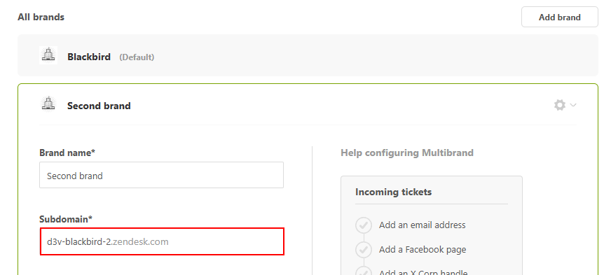

# Blackbird.io Zendesk

Blackbird is the new automation backbone for the language technology industry. Blackbird provides enterprise-scale automation and orchestration with a simple no-code/low-code platform. Blackbird enables ambitious organizations to identify, vet and automate as many processes as possible. Not just localization workflows, but any business and IT process. This repository represents an application that is deployable on Blackbird and usable inside the workflow editor.

## Introduction

<!-- begin docs -->

Zendesk is a customer service solution provider. Its feature set includes ticketing, chat, helpdesk articles and a Sales CRM. This Zendesk app primarily focusses on helpdesk articles and its localization features. It also includes actions for tickets.

## Before setting up

Before you can connect you need to make sure that:

- You have a Zendesk account on the instance you want to connect to.
- Your Zendesk account has the right permissions. It is recommended that you have the **admin role for Zendesk guide**. Furthermore, if you want to setup event triggers you will need to have either the **admin role for Zendesk suppport** or you need to have a [custom role](https://support.zendesk.com/hc/en-us/articles/4408882153882-Creating-custom-roles-and-assigning-agents#topic_cxn_hig_bd) with permission to manage webhooks.

## Connecting

1. Navigate to apps and search for Zendesk.
2. Click _Add Connection_.
3. Name your connection for future reference e.g. 'My client'.
4. Fill in the Base URL to the Zendesk instance you want to connect to. The base URL is of shape `https://<instance name>.zendesk.com`. You can usually copy this part of the URL when you are logged into your Zendesk instance. Note: for different brands see disclaimer below.
5. Click _Authorize connection_.
6. Follow the instructions that Zendesk gives you, authorizing Blackbird.io to act on your behalf.
7. When you return to Blackbird, confirm that the connection has appeared and the status is _Connected_.

> **Connecting to different brands**: If your Zendesk has multiple brands, you need to create a different connection for each separate brand. Brands are distinct by their base URL. You can find the base URL by going to *Settings > Account > Brand management > Brands* and viewing the *Subdomain* attribute of each brand. Use the Subdomain attribute in the Base URL connection input.

## Actions

### Articles

- **Search articles** search articles using various filter parameters
- **Get/create/update/archive article (metadata)** used to configure metadata variables such as section, author, position, permission group, user segment, missing locales, outdated locales, etc.
- **Download article** downloads the translatable content of an article as a file. Use this action in conjunction with some translation app and 'Upload article'.
- **Upload article** updates the translation for an article, creates a new translation if there is none. Takes a translated file as input. As the article ID is included in the head of the file, it will update the correct article, but you can specify the `Article ID` in the action as well.
- **Add label to article** on a professional or enterprise plan, it adds a label to an article.
- **Delete label from article** on a professional or enterprise plan, it deletes a label from an article.

### Categories

- **Search categories** returns all categories on this Zendesk instance. You can also specify the _Missing translation in_ variable, in which case this action will only return categories that are actually missing translations in that language.
- **Get/Create/update/delete category**.
- **Get category translation** returns the content of a category, namely its name and description (body).
- **Update category translation** creates a translation if there is none, or updates the translation if it already exists.

### Sections

- **Search sections** returns all sections on this Zendesk instance. Optionally you can also specify the category, which will limit the search to that specific category. You can also specify the _Missing translation in_ variable, in which case this action will only return sections that are actually missing translations in that language.
- **Get/Create/update/delete section**.
- **Get section translation**  returns the content of a section, namely its name and description (body).
- **Update section translation** creates a translation if there is none, or updates the translation if it already exists.

### General

- **Search helpcenter languages** returns the default language of the helpcenter, the additional languages, as well as the complete list of languages that have been configured in Zendesk. You can find these settings in the Zendesk help center > Settings > Language settings.

### Tickets

- **Search/get/create/update/delete ticket**.

## Events

- **On article published** is the most useful event. This event is triggered when any article is published and could be the perfect trigger for sending the article for translation based on the missing translations (see example). It has an optional parameter _Only source articles_ which, if true, will only trigger the bird if the source locale of the article is published. This is helpful to not create infinite publish loops of translations.
- **Other** events for article comments, subscriptions, votes and user events.

## Example

This example shows one of many use cases. Here, whenever an article is published we fetch the missing translations and retrieve the article as an HTML file. Then we create a new Lokalise project with the missing locales as the target languages and upload the article. Then we send a Slack message to notify the project manager.

## Demo video

How to Localize Zendesk Articles Automatically with Blackbird.io

import { YouTube } from '@astro-community/astro-embed-youtube';

<YouTube id="https://youtu.be/Nza3A0s81QY" />

## Missing features

Most content related actions exist. However, in the future we can add actions for:

- Article attachments
- Topics and Posts
- Comments
- Subscriptions
- Votes
- In depth tickets

Let us know if you're interested!

## Feedback

Feedback to our implementation of Zendesk is always very welcome. Reach out to us using the established channels or create an issue.

<!-- end docs -->
