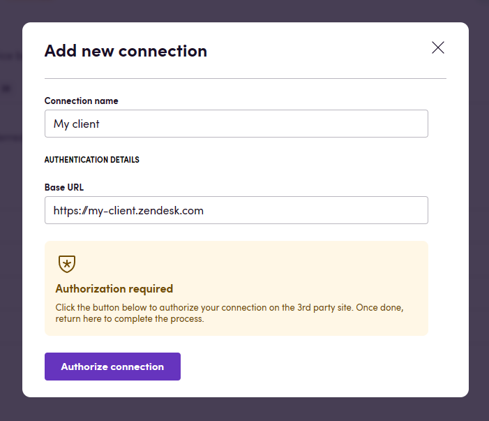
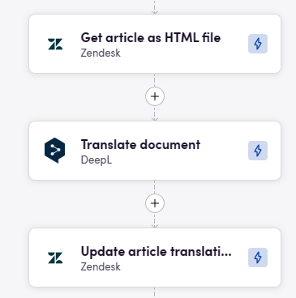

# Blackbird.io Zendesk

Blackbird is the new automation backbone for the language technology industry. Blackbird provides enterprise-scale automation and orchestration with a simple no-code/low-code platform. Blackbird enables ambitious organizations to identify, vet and automate as many processes as possible. Not just localization workflows, but any business and IT process. This repository represents an application that is deployable on Blackbird and usable inside the workflow editor.

## Introduction

<!-- begin docs -->

Zendesk is a customer service solution provider. Its feature set includes ticketing, chat, helpdesk articles and a Sales CRM. This Zendesk app primarily focusses on helpdesk articles and its localization features. It also includes actions for tickets.

## Before setting up

Before you can connect you need to make sure that:

- You have a Zendesk account on the instance you want to connect to.
- Your Zendesk account has the right permissions. It is recommended that you have the **admin role for Zendesk guide**. Furthermore, if you want to setup event triggers you will need to have either the **admin role for Zendesk suppport** or you need to have a [custom role](https://support.zendesk.com/hc/en-us/articles/4408882153882-Creating-custom-roles-and-assigning-agents#topic_cxn_hig_bd) with permission to manage webhooks.

## Connecting

1. Navigate to apps and search for Zendesk. If you cannot find Zendesk then click _Add App_ in the top right corner, select Zendesk and add the app to your Blackbird environment.
2. Click _Add Connection_.
3. Name your connection for future reference e.g. 'My client'.
4. Fill in the Base URL to the Zendesk instance you want to connect to. The base URL is of shape `https://<instance name>.zendesk.com`. You can usually copy this part of the URL when you are logged into your Zendesk instance.
5. Click _Authorize connection_.
6. Follow the instructions that Zendesk gives you, authorizing Blackbird.io to act on your behalf.
7. When you return to Blackbird, confirm that the connection has appeared and the status is _Connected_.

## Actions

### General

- **Get helpcenter locales** returns both the default locale of the helpcenter, as well as the list of locales that have been configured in Zendesk. You can find these settings in the Zendesk help center > Settings > Language settings.
- **Delete translation** can be used with any translation retrieved from articles, categories or sections.

### Articles

- **Get all articles** fetches all articles that have updated since a configurable amount of hours. You can use this endpoint to schedule birds that fetch all the updated content in order to translate this content. Optionally you can also specify the category, which will limit the search to that specific category. You can also specify the _Missing translation in_ variable, in which case this action will only return articles that are actually missing translations in that language.
- **Create/update/archive article**.
- **Get article missing translations** returns a list of locales that have been configured in Zendesk but are not present for this article. It can be used to create the missing translations.
- **Update article translation** creates a translation if there is none, or updates the translation if it already exists.
- **Get article** returns all article information. If you are on a professional or enterprise plan it will also return its labels.
- **Get article translation** returns an article translation's information. If you are on a professional or enterprise plan it will also return its labels.
- **Add label to article** on a professional or enterprise plan, it adds a label to an article.
- **Delete label from article** on a professional or enterprise plan, it deletes a label from an article.

Furthermore, we have created a useful set of actions in order to treat Zendesk articles as HTML files. This allows you to create workflows translating Zendesk articles without individually sending the title and content strings for translation.

- **Get article as HTML file** returns an HTML file with the header title as the article title and the body populated with the article content.
- **Update article translation from HTML file** expects an HTML file with a similar structure as the previous action. For the rest it behaves the same as _Update article translation_.

### Categories

- **Get all categories** returns all categories on this Zendesk instance. You can also specify the _Missing translation in_ variable, in which case this action will only return categories that are actually missing translations in that language.
- **Get category articles** returns all articles in this category.
- **Create/update/delete category**.
- **Get category missing translations** returns a list of locales that have been configured in Zendesk but are not present for this category. It can be used to create the missing translations.
- **Update category translation** creates a translation if there is none, or updates the translation if it already exists.

### Sections

- **Get all sections** returns all sections on this Zendesk instance. Optionally you can also specify the category, which will limit the search to that specific category. You can also specify the _Missing translation in_ variable, in which case this action will only return sections that are actually missing translations in that language.
- **Create/update/delete section**.
- **Get section missing translations** returns a list of locales that have been configured in Zendesk but are not present for this section. It can be used to create the missing translations.
- **Update section translation** creates a translation if there is none, or updates the translation if it already exists.

### Tickets

- **Create/update/delete ticket**.

## Events

- **On article published** is the most useful event. This event is triggered when any article is published and could be the perfect trigger for sending the article for translation based on the missing translations (see example). It has an optional parameter _Only source articles_ which, if true, will only trigger the bird if the source locale of the article is published. This is helpful to not create infinite publish loops of translations.
- **Other** events for article comments, subscriptions, votes and user events.

## Example

This example shows one of many use cases. Here, whenever an article is published we fetch the missing translations and retrieve the article as an HTML file. Then we create a new Lokalise project with the missing locales as the target languages and upload the article. Then we send a Slack message to notify the project manager.

## Missing features

Most content related actions exist. However, in the future we can add actions for:

- Article attachments
- Topics and Posts
- Comments
- Subscriptions
- Votes
- In depth tickets

Let us know if you're interested!

## Feedback

Feedback to our implementation of Zendesk is always very welcome. Reach out to us using the established channels or create an issue.

<!-- end docs -->
